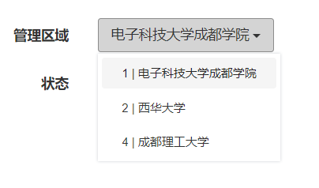

# 项目进度

## 2020.08.21
+ 管理员新增功能
+ 管理员删除功能 
> 删除的实现：更改数据库管理员的status值，1 正常 2 禁用 3 删除


## 2020.08.20
+ 根据详情页面调整了新增页面，前端账号、密码、手机号等合法性判断


## 2020.08.19
+ 完成管理员信息修改（设计超管和普管权限划分，主要由前端控制）
+ 下拉列表实现方案采用bootstrap框架实现
（获取选项id方式后续可以优化，目前采用的是将id丢到a标签的text里，但如果数据库id不连续，在界面上直接暴露给用户，体验不佳）
```html
    <!--下拉列表-->
    <div class="dropdown">
        <button type="button" class="btn btn-default dropdown-toggle manage_school disabled_flag" data-toggle="dropdown">
            <span class="buttonText">{$info.school_name}</span>
            <span class="caret"></span>
        </button>
        <input type="hidden" name="manage_school" value="{$info.manage_school}">
        <ul class="dropdown-menu" role="menu">
            {volist name="$school_list" id="vo"}
            <li><a href="#" onclick="shows($(this).text())">{$vo.school_id}<span> | </span>{$vo.school_name}</a></li>
            {/volist}
        </ul>
    </div>
```
```javascript
    // 下拉列表点击选项触发的函数
    function shows(text) {
        // 分割a标签text文本内容 -> id name
        var strArray = text.split(' | ')
        // 显示内容 name
        $('.buttonText').text(strArray[1]);
        // 选择管理区域 id
        $('input[name="manage_school"]').val(strArray[0]);
    }
```




## 2020.08.18
+ 完成管理员列表显示
+ 添加记录系统日志的功能
+ 管理员信息和操作日志的显示
+ 寻找合适的下拉列表方案，bootstrap,jqueryUI(放弃),layui...

## 2020.08.17
+ 完成后台登录的界面及功能
+ 尝试采用Grid.js作为后台表格样式的优化方案，失败
+ 完成后台登录成功后自动播放背景音乐，点击音乐图标可暂停。（该功能后续需要斟酌，改为首次进入播放或其他）

## 更早之前
+ emmm，估计这就叫摸鱼叭。。。嘿嘿。。

ThinkPHP 5.0
===============

[](https://packagist.org/packages/topthink/think)
[](https://packagist.org/packages/topthink/think)
[](https://packagist.org/packages/topthink/think)
[](https://packagist.org/packages/topthink/think)

ThinkPHP5在保持快速开发和大道至简的核心理念不变的同时，PHP版本要求提升到5.4，对已有的CBD模式做了更深的强化，优化核心，减少依赖，基于全新的架构思想和命名空间实现，是ThinkPHP突破原有框架思路的颠覆之作，其主要特性包括：

 + 基于命名空间和众多PHP新特性
 + 核心功能组件化
 + 强化路由功能
 + 更灵活的控制器
 + 重构的模型和数据库类
 + 配置文件可分离
 + 重写的自动验证和完成
 + 简化扩展机制
 + API支持完善
 + 改进的Log类
 + 命令行访问支持
 + REST支持
 + 引导文件支持
 + 方便的自动生成定义
 + 真正惰性加载
 + 分布式环境支持
 + 更多的社交类库

> ThinkPHP5的运行环境要求PHP5.4以上。

详细开发文档参考 [ThinkPHP5完全开发手册](http://www.kancloud.cn/manual/thinkphp5)

## 目录结构

初始的目录结构如下：

~~~
www  WEB部署目录（或者子目录）
├─application           应用目录
│  ├─common             公共模块目录（可以更改）
│  ├─module_name        模块目录
│  │  ├─config.php      模块配置文件
│  │  ├─common.php      模块函数文件
│  │  ├─controller      控制器目录
│  │  ├─model           模型目录
│  │  ├─view            视图目录
│  │  └─ ...            更多类库目录
│  │
│  ├─command.php        命令行工具配置文件
│  ├─common.php         公共函数文件
│  ├─config.php         公共配置文件
│  ├─route.php          路由配置文件
│  ├─tags.php           应用行为扩展定义文件
│  └─database.php       数据库配置文件
│
├─public                WEB目录（对外访问目录）
│  ├─index.php          入口文件
│  ├─router.php         快速测试文件
│  └─.htaccess          用于apache的重写
│
├─thinkphp              框架系统目录
│  ├─lang               语言文件目录
│  ├─library            框架类库目录
│  │  ├─think           Think类库包目录
│  │  └─traits          系统Trait目录
│  │
│  ├─tpl                系统模板目录
│  ├─base.php           基础定义文件
│  ├─console.php        控制台入口文件
│  ├─convention.php     框架惯例配置文件
│  ├─helper.php         助手函数文件
│  ├─phpunit.xml        phpunit配置文件
│  └─start.php          框架入口文件
│
├─extend                扩展类库目录
├─runtime               应用的运行时目录（可写，可定制）
├─vendor                第三方类库目录（Composer依赖库）
├─build.php             自动生成定义文件（参考）
├─composer.json         composer 定义文件
├─LICENSE.txt           授权说明文件
├─README.md             README 文件
├─think                 命令行入口文件
~~~

> router.php用于php自带webserver支持，可用于快速测试
> 切换到public目录后，启动命令：php -S localhost:8888  router.php
> 上面的目录结构和名称是可以改变的，这取决于你的入口文件和配置参数。

## 命名规范

`ThinkPHP5`遵循PSR-2命名规范和PSR-4自动加载规范，并且注意如下规范：

### 目录和文件

*   目录不强制规范，驼峰和小写+下划线模式均支持；
*   类库、函数文件统一以`.php`为后缀；
*   类的文件名均以命名空间定义，并且命名空间的路径和类库文件所在路径一致；
*   类名和类文件名保持一致，统一采用驼峰法命名（首字母大写）；

### 函数和类、属性命名

*   类的命名采用驼峰法，并且首字母大写，例如 `User`、`UserType`，默认不需要添加后缀，例如`UserController`应该直接命名为`User`；
*   函数的命名使用小写字母和下划线（小写字母开头）的方式，例如 `get_client_ip`；
*   方法的命名使用驼峰法，并且首字母小写，例如 `getUserName`；
*   属性的命名使用驼峰法，并且首字母小写，例如 `tableName`、`instance`；
*   以双下划线“__”打头的函数或方法作为魔法方法，例如 `__call` 和 `__autoload`；

### 常量和配置

*   常量以大写字母和下划线命名，例如 `APP_PATH`和 `THINK_PATH`；
*   配置参数以小写字母和下划线命名，例如 `url_route_on` 和`url_convert`；

### 数据表和字段

*   数据表和字段采用小写加下划线方式命名，并注意字段名不要以下划线开头，例如 `think_user` 表和 `user_name`字段，不建议使用驼峰和中文作为数据表字段命名。

## 参与开发

请参阅 [ThinkPHP5 核心框架包](https://github.com/top-think/framework)。

## 版权信息

ThinkPHP遵循Apache2开源协议发布，并提供免费使用。

本项目包含的第三方源码和二进制文件之版权信息另行标注。

版权所有Copyright © 2006-2018 by ThinkPHP (http://thinkphp.cn)

All rights reserved。

ThinkPHP® 商标和著作权所有者为上海顶想信息科技有限公司。

更多细节参阅 [LICENSE.txt](LICENSE.txt)


